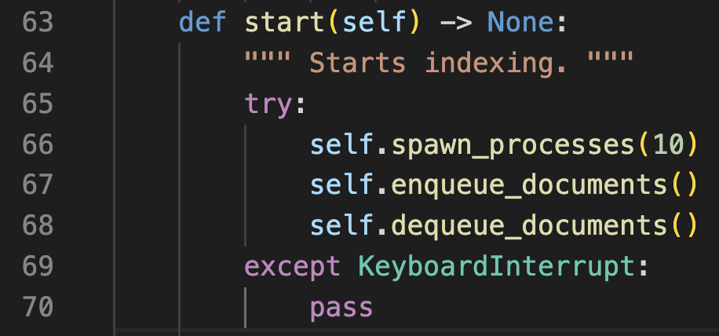

# CS 121 Search Engine 

## A fully functional search engine written in Python

This project is based on Professor Knone's Martin's Assignment 3 which is to create a search engine. Every part of this README.md will show you how to do the following:

* Create an index from the given webpages
* Launch the GUI application 
* Perform a query within the GUI 
* Automatically write out a report for a set of queries 

## Watch the video below 

   super cool video link here

## Setup and Installation 

You will need to install the following libraries beforehand using pip install or brew.

## Libraries to install 

1. `beautifulsoup4`
2. `msgspec`
3. `lxml`
4. `nltk`
5. `openai`

This can all be installed with one simple command below:

```sh
pip install beautifulsoup4 msgspec lxml nltk openai
```

Once installed you're ready to create your index! 


## Creating an index

To create your index navigate to the directory of the project and enter into the terminal the following command
```sh
python3 launch.py 
```

if you would like to restart the index for any reason include ```--restart``` as an argument at the end of the command 


**NOTE: the creation of the index utilizes multithreading for maxininum peformance, please modify the value in line 66 in the file src/inverted_index.py as shown below (deafult is currently set to 10 threads) if you're experiencing issues.** 



After your index has been created you may now start the applicaation!

## Running the GUI Application 

To start the application type in the following command in the same directory    
```streamlit run search_engine.py```

You will promptly be redirected to the application via a webpage where you will see this 


simply type in any query and page results will pop up, you may continue to enter new queries over and over until you decide to exit the program 

to end the Streamlit application, within your IDE, navigate to your terminal and enter the following key combination ```ctrl + c```

